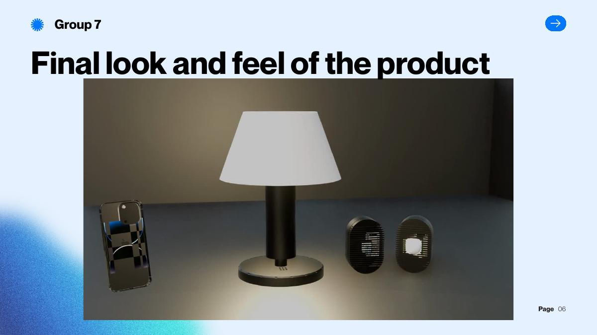

<a id="top"></a>

# FindMe - True Presence Detection

<p align="center">
  
</p>

<p align="center">
  
  <a href="https://github.com/ADreLOI/ICTI-Project-FindMe/stargazers"></a>
  <a href="https://github.com/ADreLOI/ICTI-Project-FindMe/graphs/contributors"></a>
  <a href="https://github.com/ADreLOI/ICTI-Project-FindMe/forks"></a>
  <a href="https://github.com/ADreLOI/ICTI-Project-FindMe/issues"></a>
  
  
  
</p>

<p align="center">
  
  
</p>

> A privacy-preserving, multi-sensor occupancy prototype for hospitality rooms and care environments. FindMe detects real guest presence, including quiet activities such as sleeping or reading, without cameras or microphones.

<p align="center"><em>Cover: FindMe's final lamp-integrated prototype concept, created by the project team.</em></p>

<details>
<summary><h2>Table of Contents 📖</h2></summary>

- [The problem](#the-problem)
- [The solution](#the-solution)
- [System architecture](#system-architecture)
- [Evaluation](#evaluation)
- [Repository guide](#repository-guide)
- [Run the prototypes](#run-the-prototypes)
- [Media and documentation](#media-and-documentation)
- [Privacy and security](#privacy-and-security)
- [Acknowledgments](#acknowledgments)
- [Team](#team)
- [Repository topics](#repository-topics)

</details>

## The problem

Traditional hotel room-management systems commonly rely on keycards and PIR motion sensors. They can classify a still guest as absent, causing false negatives that affect comfort, energy management, and safety.

FindMe addresses this gap for luxury hospitality, assisted living, and rehabilitation scenarios, where true presence matters even when a person is not moving.

## The solution

FindMe is designed as a plug-and-play bedside-lamp concept with sensing integrated in a discrete enclosure. It combines:

- 24 GHz mmWave radar for micro-movements such as breathing
- PIR sensing for motion events
- CO2 / TVOC context from an SGP30 environmental sensor
- BLE badges for staff and janitor context
- ESP-NOW communication between nodes and MQTT integration with the room-management mockup
- DOWA and Dempster-Shafer Theory fusion to combine evidence and represent uncertainty

No camera or microphone is used.

## System architecture

```text
PIR node + BLE badge ------ ESP-NOW ------+
                                             \
mmWave radar + CO2 / TVOC --- UART / I2C ---- ESP32-S3 master --- MQTT --- Room-control mockup
                                              /
                              DOWA / DST evidence fusion
```

The fusion model produces **Occupied**, **Empty**, or **Unknown** evidence states. Sensor weights can be reduced when a sensor is inactive or reports an error, preventing one weak input from dominating the decision.

## Evaluation

The final prototype evaluation used **250 samples**. It reported **zero false negatives**, **100% recall**, **71.6% precision**, **83.5% F1 score**, and **76.4% accuracy**. These results prioritise reliable presence detection, which is the core safety requirement of the concept.

The project was discussed with **VDA Telkonet** and demonstrated with hospitality stakeholders at **Best Western Hotel Adige**.

## Repository guide

```text
src/                         # ESP32-S3 firmware and sensor integration
src/tests/                   # Isolated tests for mmWave, PIR, BLE, MQTT, ESP-NOW, and fusion
mockup/                      # Vite + React room-control interface
Slides/                      # Project presentation material
MOD_DOWA_Fusion_Model.pdf    # Fusion-model reference
sessione_completa.csv        # Evaluation-session data
platformio.ini               # ESP32-S3 PlatformIO configuration
```

## Run the prototypes

### Firmware

Install [PlatformIO](https://platformio.org/), then create a local configuration file before connecting to any network:

```bash
cp src/config.example.h src/config.h
# Edit src/config.h with your isolated demo Wi-Fi and MQTT values.
pio run -e esp32s3_n16r8
pio run -e esp32s3_n16r8 -t upload
pio device monitor -b 115200
```

`src/config.h` is ignored by Git. Never commit a Wi-Fi password, MQTT credential, room identifier, or production endpoint.

### Room-control mockup

```bash
cd mockup
cp .env.example .env
npm install
npm run dev
```

The mockup is a demonstrator: its technician password must be configured locally, and production authentication belongs on a server rather than in browser code.

## Media and documentation

- [DOWA fusion-model reference](./MOD_DOWA_Fusion_Model.pdf)
- [Presentation material](./Slides)
- Final presentation videos, including the demo, lamp hardware mockup, interface mockup, and failure-model overview, are retained with the course project material.

## Privacy and security

- The design avoids cameras and microphones.
- Network and mockup credentials are intentionally local-only and ignored by Git.
- The prototype's client-side UI guard is demo-only; real deployments require server-side authentication, TLS, access control, and credential rotation.

## Acknowledgments

FindMe was developed for the **ICT Innovation** course at the University of Trento under the guidance of [**Prof. Marco Formentini**](https://www.soi.unitn.it/staff/marco-formentini). We thank him for the innovation-method guidance and feedback provided throughout the project.

We also thank [**VDA Telkonet**](https://telkonet.com/) for presenting the true-presence-detection challenge, sharing hospitality-domain insight, and providing feedback during the project. FindMe is an academic proof of concept and is not presented as an official commercial VDA Telkonet product.

<p align="center">
  <a href="https://telkonet.com/">
    <picture>
      <source media="(prefers-color-scheme: dark)" srcset="./assets/acknowledgments/vda-telkonet-white.png">
      <source media="(prefers-color-scheme: light)" srcset="./assets/acknowledgments/vda-telkonet-dark-text.png">
      
    </picture>
  </a>
</p>

## Team

**Team 7**

| Member | GitHub | LinkedIn | Email |
| --- | --- | --- | --- |
| Andrea Lo Iacono | [ADreLOI](https://github.com/ADreLOI) | [Andrea Lo Iacono](https://www.linkedin.com/in/adreloi) | [andrea.loiacono@studenti.unitn.it](mailto:andrea.loiacono@studenti.unitn.it) |
| Jago Revrenna | [jagorev](https://github.com/jagorev) | [Jago Revrenna](https://www.linkedin.com/in/jagorevrenna) | [jago.revrenna@studenti.unitn.it](mailto:jago.revrenna@studenti.unitn.it) |
| Matthew De Marco | [MattDema](https://github.com/MattDema) | [Matthew De Marco](https://www.linkedin.com/in/matt-de-marco/) | [matthew.demarco@studenti.unitn.it](mailto:matthew.demarco@studenti.unitn.it) |
| Sophia Sau | Not publicly available | [Sophia Sau](https://www.linkedin.com/in/sophia-sau-200034348) | [sophia.sau@studenti.unitn.it](mailto:sophia.sau@studenti.unitn.it) |
| Alessio Leonardi | Not publicly available | [Alessio Leonardi](https://www.linkedin.com/in/alessio-leonardi2) | [alessio.leonardi@studenti.unitn.it](mailto:alessio.leonardi@studenti.unitn.it) |

<p align="center">
  <a href="#top" style="text-decoration: none;">
    
    <br>
    <strong>Back to Top</strong>
  </a>
</p>
